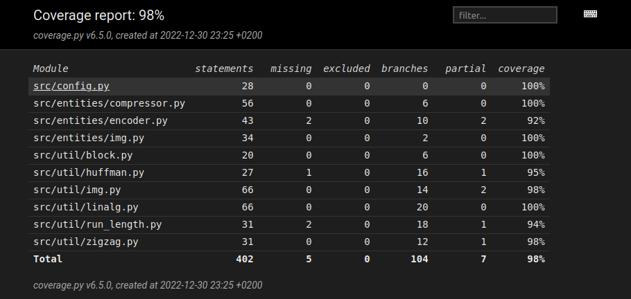
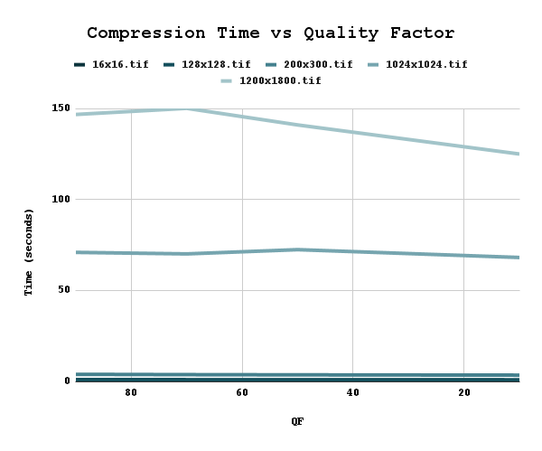
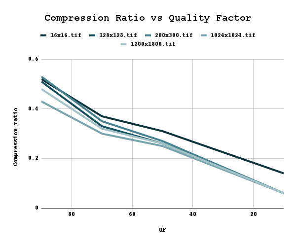

# Testing document

The application has been tested both manually and automatically. Running the application gives the option to run the example, which shows some data about compression times and ratios. Pylint is also in use to keep the code quality good (current score 9.17/10), and linting can be run by command `poetry run invoke lint`.

## Unit tests

The project is fully unit tested excluding the UI, which has been tested manually. The unit tests can be run by command `poetry run invoke test`.

### Entities

As the compressor object is mostly a wrapper for other functionalities that are separately tested, the unit test for the module only checks that a `CompressedImage` object is created after the encoding is run. Similarly, the testing for the `Encoder` object checks that it returns the encoded binary strings for given data. The tests for image objects (`RawImage` and `CompressedImage`) check that the contain the data required.

### Utilities

As the utility functions contain most of the actual functionality and algorithms, they are tested more thoroughly.

The `block` tests check that an image can be sliced to a 8 x 8 block correctly, and that the sliced image bocks can be combined back to the original image (matrix). Tests for quantising and dequantising are also included.

The tests for Huffman encoding only include test that right values are read from the predetermined Huffman tables – the other version of Huffman coding (where the tables are created) is not tested, as it is not implemented in the main program. For differential and run length encoding and decoding, the tests check that the encoded data is decoded so that it is equal to the original data (before encoding). The `zigzag` module is tested similarly.

The test for image-related utilities check that colour space conversion works properly, and that the image is padded to the size wanted. The linear algebra functions are tested against the built-in NumPy and SciPy functions that calculate the same things.

### Test coverage

The coverage report can be generated from command line by `poetry run invoke coverage-report`.

Test coverage Sat Dec 31st, 2022:

## Manual testing

The manual testing has mostly consisted of running the application over and over again during the development. Some of the results below are from earlier versions of the application, and no longer relevant or repeatable.

### Downsampling

There are several methods I tried for writing the algorithm for chroma subsampling. The fastest version (repeating values in the matrix, which is the version in use) takes approximately 0.01 seconds for a 1024 x 1024 image, while the averaging method takes approximately 3.63 seconds and the convolution method 3.17 seconds with my setup.

### Runtimes and compression ratios

How the size of the image affects the runtime and compression ratio (i.e. the size of the compressed image) is represented below in a table, and some graphs are also included to show how exponentially the runtime grows with bigger images. These results can be replicated by running the example included in the application.

| Image | Quality Factor (QF) | Time (s) | Compressed Size (bytes) | Compression Ratio |
|---|---|---|---|---|
| 16x16.tif (908 bytes) | 90 | 0.0313 | 468 | 0.52 |
| 16x16.tif (908 bytes) | 70 | 0.0182 | 340 | 0.37 |
| 16x16.tif (908 bytes) | 50 | 0.0165 | 280 | 0.31 |
| 16x16.tif (908 bytes) | 10 | 0.0152 | 128 | 0.14 |
| 128x128.tif (49292 bytes) | 90 | 1.042 | 25120 | 0.51 |
| 128x128.tif (49292 bytes) | 70 | 0.9872 | 16428 | 0.33 |
| 128x128.tif (49292 bytes) | 50 | 0.971 | 12884 | 0.26 |
| 128x128.tif (49292 bytes) | 10 | 0.9223 | 2996 | 0.06 |
| 200x300.tif (180140 bytes) | 90 | 3.9067 | 95384 | 0.53 |
| 200x300.tif (180140 bytes) | 70 | 3.7302 | 62392 | 0.35 |
| 200x300.tif (180140 bytes) | 50 | 3.6175 | 48952 | 0.27 |
| 200x300.tif (180140 bytes) | 10 | 3.4685 | 10736 | 0.06 |
| 1024x1024.tif (3359506 bytes) | 90 | 70.9722 | 1460072 | 0.43 |
| 1024x1024.tif (3359506 bytes) | 70 | 70.1402 | 1014844 | 0.30 |
| 1024x1024.tif (3359506 bytes) | 50 | 72.4696 | 846080 | 0.25 |
| 1024x1024.tif (3359506 bytes) | 10 | 68.1594 | 197464 | 0.06 |
| 1200x1800.tif (6629950 bytes) | 90 | 146.7987 | 3211104 | 0.48 |
| 1200x1800.tif (6629950 bytes) | 70 | 150.1726 | 2100632 | 0.32 |
| 1200x1800.tif (6629950 bytes) | 50 | 141.0417 | 1751308 | 0.26 |
| 1200x1800.tif (6629950 bytes) | 10 | 125.0539 | 384704 | 0.06 |

